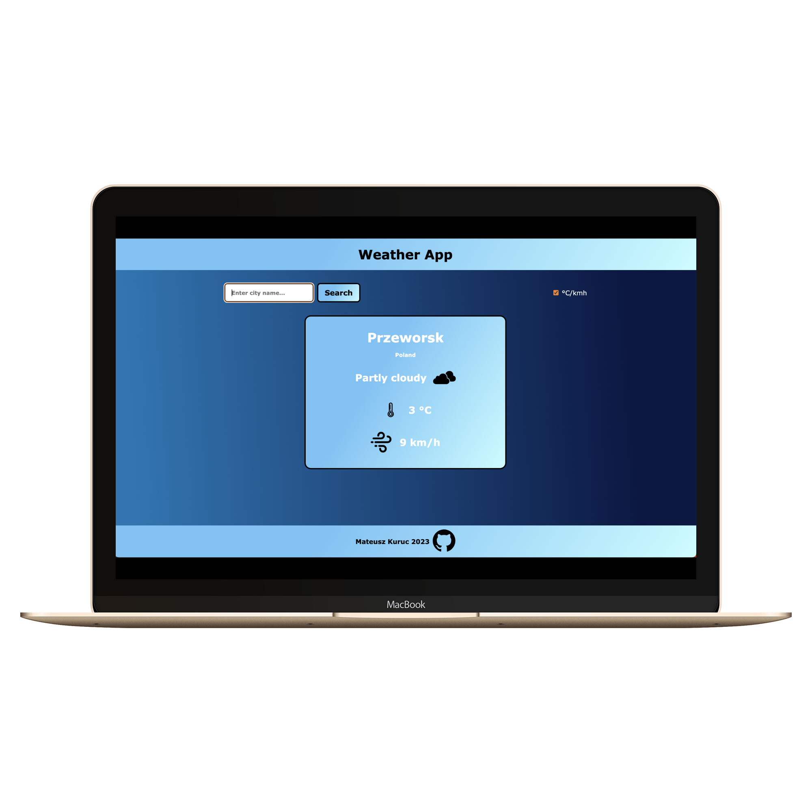

# odin-weather-app

Weather app that allows you to check weather conditions in any place you want.

<h2>Goals</h2>

The aim is to build an app which will handle the data provided by the external API and display the results to the user.

The app is built with JavaScript, HTML and CSS.

This is the first time I used external API to get data from the internet and then handle and display it within the browser. This was a great push for me to learn about asynchronous JavaScript, how to ask for data and receive it, as well as basic error handling.

<h2>Key features</h2>
<ul>
  <li>Search for location and display weather data</li>
  <li>Toggle between Celsius and Fahrenheit degrees for temperature and kilometers vs miles for wind speed</li>
  <li>Basic validation in search bar, display error message if the location does not exist</li>
  <li>Use external API with individual key to handle weather data</li>
</ul>
<h2>Visual representation</h2>

